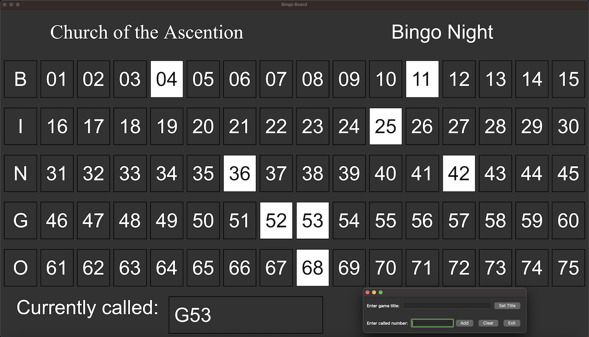

# BingoBoard
Project: Create a numbers called board for a Bingo night at the KofC

This repository contains a Bingo Board program and related programs and files for a Bingo night. The intention would be to put the large window
showing all the numbers on to a large screen HDMI television, with the smaller window on the computer, allowing someone to enter the numbers as
they are called. These would then be displayed highlighted on the large board.

Version 2.0 introduces an "automatic" mode, which generates random numbers and places them on the board based on 
a repeat time given by the user. The timing can run from "manual", meaning that one number will be called each time 
the start button is clicked, up to automatically doing the next call every 60 seconds. There is a Pause button
to pause the game (i.e. to check someone's Bingo). The game resumes when Start is pressed again. Clear clears
the board and starts a new game.

A more robust command line syntax is implemented, allowing for both displaying numbers generated externally 
(like with a traditional ball tumbler) or for running the game entirely generating random calls within the
program. Options are implemented to change the page header title and message.

This program uses PyQt5 to format the displays. All code is Copyright Robert P. Nix, 2023, 2024
