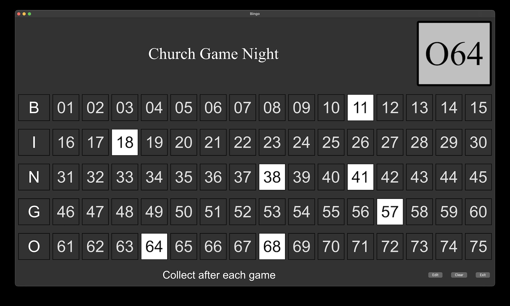

# BingoBoard
Project: Create a numbers called board for a Bingo night at the Knights of Columbus

This repository contains a Bingo Board program and related programs and files for a Bingo night. The intention would be to put the window
showing all the numbers on to a large screen via HDMI or a network connection to the television. On the computer, clicking on the
individual numbers will highlight them as the numbers are called.

----

Version 2.0 introduces an "automatic" mode, which generates random numbers and places them on the board based on
a repeat time given by the user. The timing can run from "manual", meaning that one number will be called each time
the start button is clicked, up to automatically doing the next call every 60 seconds. There is a Pause button
to pause the game (i.e. to check someone's Bingo). The game resumes when Start is pressed again. Clear clears
the board and starts a new game.

A more robust command line syntax is implemented, allowing for both displaying numbers generated externally
(like with a traditional ball tumbler) or for running the game entirely generating random calls within the
program. Options are implemented to change the page header title and message.

Version 4.0 consolidates the controls on to the main window. 
Display of the currently called number is displayed more prominently at the top of the screen.

Version 5.0 introduces color pallettes to allow different display colors on the board. It adds a --pallette switch to
select which pallette to use, and defaults to "default". The individual pallettes are defined in pallettes.py, which
associates a set of CSS attributes with each type of display element. New pallettes can be defined in pallettes.py
by following the pattern used in the examples given there.

Version 6.0 introduces a live feed camera option to be used to show the bingo balls on the physical machine as they
are called. Also, the pallette definitions are loaded from a pallettes.json file, to separate the screen customization
from the program code.

Versions 7 and 8 clean up the code, and were attempts to identify the proper camera at runtime without manually specifying it.

Version 9.0 implements a manual camera selection, which gives the camera index that the expected camera should appear as.
This version also implements the feature of flashing the currently called number in the grid of numbers. This was requested
because of the functioning of the physical display boards available, in spite of the fact that the currently called
number was being displayed in huge letters at the top of the screen. Go figure. Also in this version is the ability
to display "Punch-Out" numbers across the bottom of the screen. Added buttons at the bottom of the screen for Punch-Out
and Record. Record logs the current game to the log file without clearing the numbers from the screen.

----

There are controls for editing the message at the top of the screen, saving a punch-out number, recording the game
without clearing the board, clearing the board, and exiting the program. When calling
numbers automatically, the time between calls can be changed, and the calls can be paused (like when checking a
winning card). In addition, for manual calling, the numbers in the main window are clickable.

Logs are produced containing the date and time of each game, and the numbers called during the game.

----

The original intention of the program was to mirror the window to a larger television. In order to mirror to
multiple TVs at the same time, Two methods are available. Using an app called "AirParrot", the screen can be mirrored
to several televisions on the same network, entirely via software. Initially, this method worked well for me on my MacBook
Pro, but I was unable to duplicate my initial success. Your mileage may vary.

Where the above method will not work, a hardware
solution can be implemented via WELUSOPU wireless HDMI sets of a transmitter and two to four receivers, sold in sets
on Amazon. These are plug-and-play wireless HDMI thransmitter and receiver sets, and work well.

-----

This program uses PyQt5 to format the displays. All code is Copyright Robert P. Nix, 2023 - 2026
